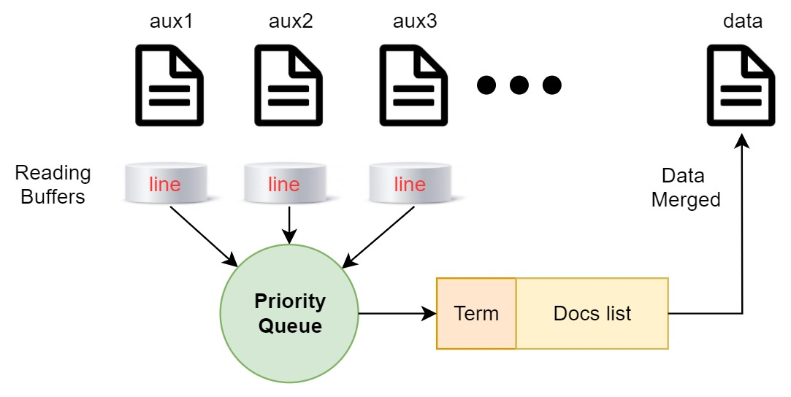
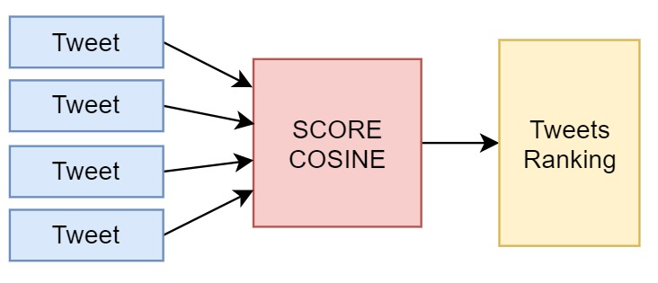
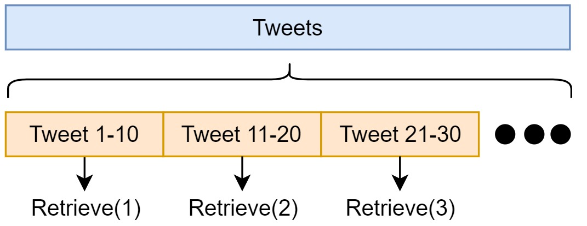

# Proyecto 2 del curso de Base de Datos II

## **Integrantes**
* Melendez Cabezas, Jean Paul
* Neira Riveros, Jorge Luis
* Surco Salas, Marcelo Juan

## **Tabla de contenido**
* [Introducción](#introducción)
* [Técnicas a usar en el proyecto](#técnicas-a-usar)
  * [Índice Invertido](#índice-invertido)
* [Implementación](#implementación)
    * [Información](#información)
    * [Data Recover](#data-recovery)
    * [Función Init](#función-init)
    * [Función Load](#función-load)
    * [Función Score](#función-score)
    * [Función Retrieve](#función-retrive)
    * [Backend](#Backend)
    * [Frontend](#Frontend)
* [Resultados](#resultados)
  * [Tiempo de ejecución](#tiempo-de-ejecución)
  * [Gráficos de comparación](#gráficos-de-comparación)
  * [Acessos a memoria secundaria](#accesos-a-memoria-secundaria)
  * [Discusión y análisis de resultados experimentales](#discusión-y-análisis-de-resultados-experimentales)
* [Pruebas y video del proyecto](#pruebas)

## **Introducción**
La razón del proyecto es crear una clase de motor de búsqueda, el cual muestre sus resultados de tweets en base a la palabra o palabras clave ingresadas.

El uso de la API de Twitter nos permitió extraer la info para ser procesada y mostrarla en una página de búsqueda mediante el uso de Flask y JavaScript para el manejo de la info.
## **Técnicas a usar**

### **Índice invertido**
Es un método para estructurar cierta información para que sea luego recuperada a través de un motor de búsqueda. Se compone de documentos, los cuales tienen términos a una determinada frecuencia. La información de estos documentos es procesada y organizada para devolver información de una forma óptima. La consulta a realizar es otro conjunto de términos, la cual se procesa y se genera un score en base a su similitud con los documentos organizados por el índice invertido. Finalmente, la estructura debe devolver los documentos más relevantes ordenados de acuerdo al score calculado para cada uno de ellos.

## **Implementación**
### **Información**
La data recopilada corresponde a aproximadamente cien mil tweets capturados a través de un script programado en Python, el cual capturó tweets en español relacionados con el tema del covid y la pandemia por aproximadamente 10 días (del 29/10/2021 al 08/11/2021), 5 a 6 horas por día.

### **Data Recovery**
Es una clase que contiene todas las funciones necesarias para procesar los tweets capturados. Cuando procesa una cierta cantidad de tweets, genera dos archivos: data.json que guarda todos los términos con su lista de documentos en los que aparece y la frecuencia; y norm.json que guarda todos los documentos (tweets) con el valor de su norma. La información a procesar debe incluirse en la carpeta data_in.

### **Función init**
El constructor de la clase cuenta los términos y tweets guardados en memoria. Además de leer la stoplist proporcionada en stoplist.txt

### **Función load**
Vacía los archivos data y norm. Procesa todos los tweets de los archivos de data_in. Para cada tweet, extrae todos los términos usando la librería nltk (clase ToktokTokenizer para español), descarta los stopwords y genera un diccionario para cada término. Cuando este diccionario llega a una cantidad de caracteres definido por una variable global (1 millón por default), se envía a memoria secundaria generando un archivo auxiliar con los términos ordenados. Los archivos auxiliares se guardan en la carpeta data_aux. Para cada tweet procesado, se guarda su norma.

Cuando termina de procesar todos los tweets, realizará el procedimiento de merge para unir todos los archivos auxiliares creados. Mantiene un buffer de lectura de una línea para cada archivo y unifica los términos comunes con un Priority Queue. Esta operación se realiza en O(nlgk) para n términos y k archivos auxiliares generados. Cada término unificado se guarda en data.json.

### **Función Score**
Se procesa el query enviado a esta función, se descartan los stopwords, y se traen de la memoria secundaria los términos y tweets relacionados con la query. Luego, utilizamos el score coseno para generar un ranking con los tweets.

### **Función Retrieve**
Una vez generado el rankink de tweets, la información se retorna por partes. Esta función debe ser llamada con un parámetro k, la cual indica qué tweets se deben retornar. Para k = 1, se retorna los 10 primeros tweets, para k = 2, los siguientes 10, y así sucesivamente. La cantidad de tweets devueltos por vez es configurable.

### **Backend**
Se implementa un backend con ayuda de Flask, y se implementan las 4 funciones detalladas del índice invertido como endpoints de la aplicación.

### **Frontend**

## **Resultados**

### **Tiempo de ejecución**

### **Gráficos de comparación**

## **Discusión y análisis de resultados experimentales**

## **Pruebas**

